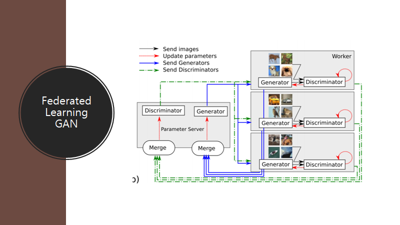
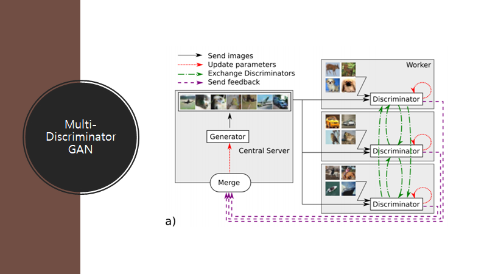

# DistributedGAN
DistributedGAN

Distributed GAN Presentation.pptx is presentation file

Generating MNIST dataset

Multiple generator and discriminator in a distributed environment

Exchanging generator and discriminator for learning speed and quality improvement

Hyperparameter search through genetic algorithms

Using Tensorflow, Ray, Python

Currently incomplete

Based on MDGAN 

https://arxiv.org/abs/1811.03850

      

Architecture of model

Example of 3 discriminator and 3 generator with 3 federated learning. It can be distributed to 3 * 3 * 3 + 1(main server) = 28 computers.

You can change the number of discriminator, generator, and federated learning.(ex. 4d, 2g, 3fl => 4 * 2 * 3 + 1 = 25 computers)
      

These are the results of distributed learning
Used the same model to see only the difference in the number of classifiers and constructors.
However, you can also create a random model to search good hyperparameters through genetic algorithm.

No significant quality improvement was seen.

Also, the speed of learning is slower because of the bottleneck caused by ray's distributed system through the Internet.

In gtx1060, 3 Generator, 2 Discriminator, 1 Federated Learning, it takes 14sec on 1 computer and 1min 17sec on 6 computers in 1 iteration.
